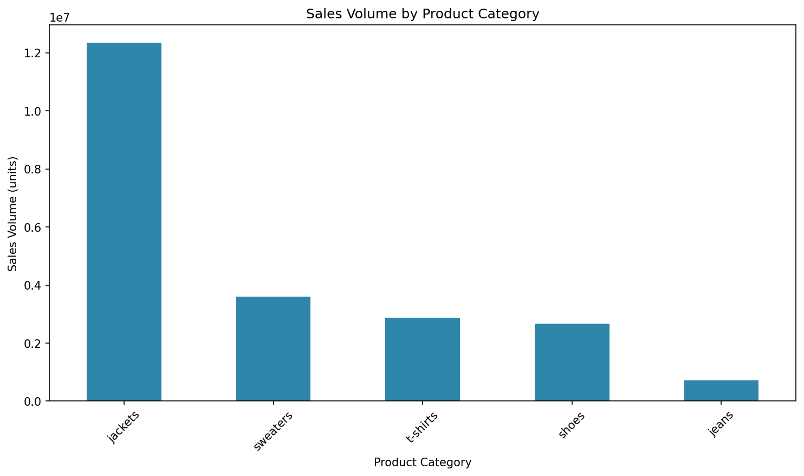
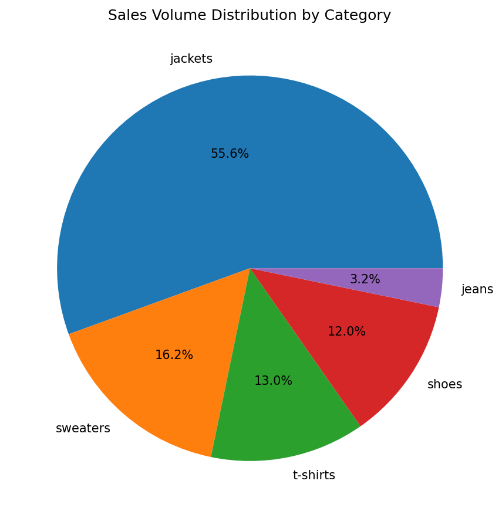
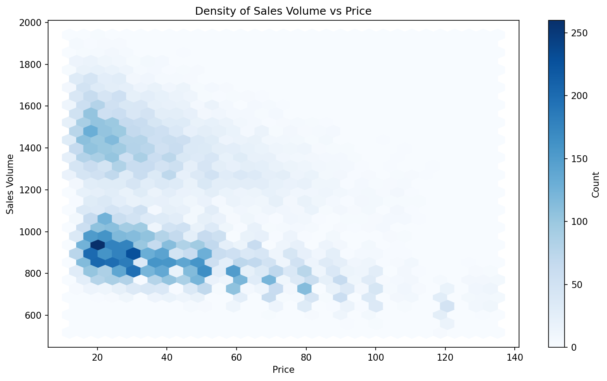
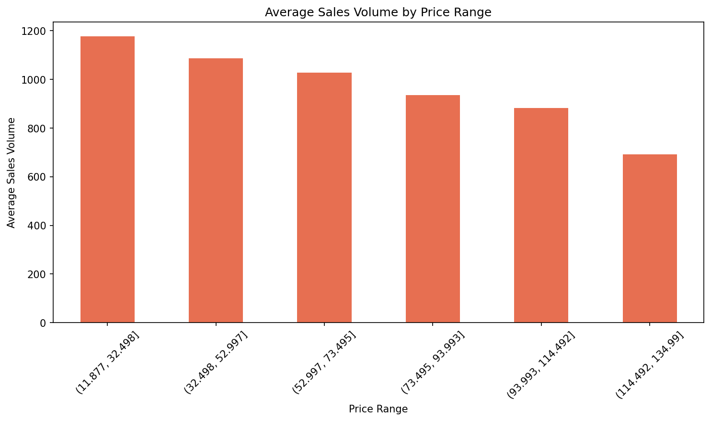
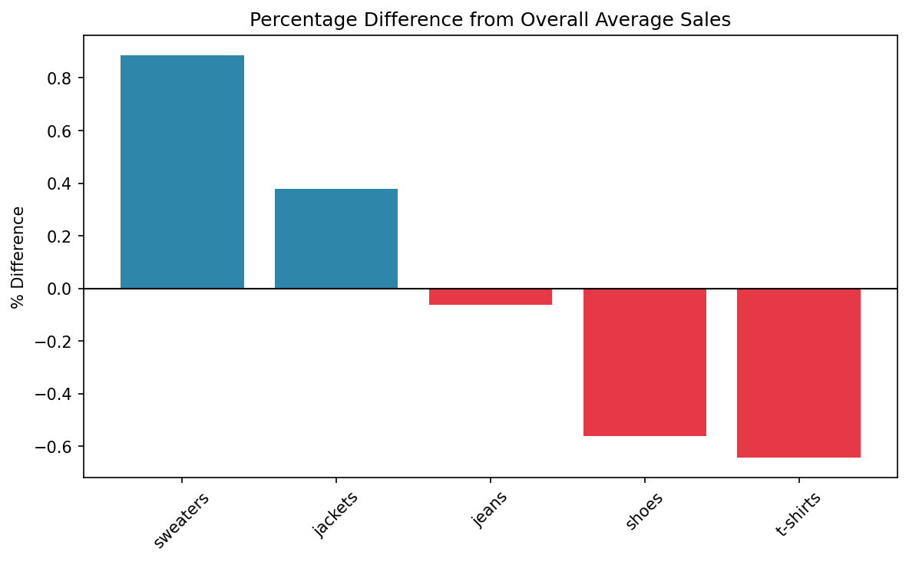
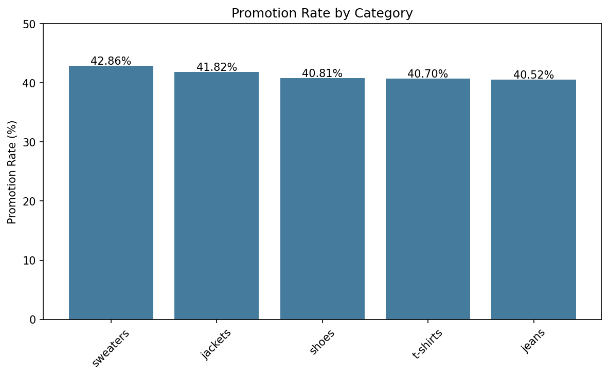

# Zara Sales — Exploratory Data Analysis

Exploratory data analysis project on a Zara retail sales dataset to identify key business drivers, revenue concentration patterns, promotion impact, and price sensitivity across product categories. The goal is to extract actionable insights that could support portfolio, pricing, and promotional decisions.

---

## Key Findings

- **Revenue concentration**: Jackets account for **55% of total revenue** ($487M out of $884.6M) and **55.6% of total sales volume** (12.3M out of 22.2M units)
- **Dominance ratio**: Jackets generate **3.41× more revenue** than the second-ranked category (sweaters at $142.9M)
- **Price sensitivity**: Moderate negative correlation between price and sales volume (**r = -0.34**) — demand decreases gradually as price increases, though price alone does not explain performance differences since average prices are nearly identical (~$41–$43) across all categories
- **Promotion parity**: Promotion rates are consistent across all categories (40.52%–42.86%), confirming that jacket dominance reflects genuine demand and scale, not disproportionate promotional activity
- **Per-item performance**: Sweaters and jackets sell above the store average per item, while jeans, shoes, and t-shirts fall below — consistent with intrinsic demand differences rather than promotional advantage
- **Seasonal demand**: Autumn records the highest sales volume (7.99M units), followed by Winter (6.04M), Spring (4.75M), and Summer (3.44M). Jackets are the top-selling category in every season without exception
- **Concentration risk**: Over 55% of both revenue and volume depend on a single category — a significant vulnerability if jacket demand declines due to changing trends or market conditions

---

## Visualizations

### Sales Volume by Category


### Revenue Distribution


### Price Sensitivity


### Average Sales by Price Range


### Category Performance vs Average


### Promotion Rate by Category


---

## Project Structure

```
Zara-Sales-EDA/
│
├── data/
│   └── raw/
│       └── Business_sales_EDA.csv
│
├── reports/
│   └── figures/                   # All charts saved as PNG
│       ├── sales_volume_by_category.png
│       ├── sales_distribution_pie.png
│       ├── sales_volume_vs_price_density.png
│       ├── avg_sales_by_price_range.png
│       ├── pct_diff_from_avg_sales.png
│       └── promotion_rate_by_category.png
│
├── analysis.ipynb                 # Full EDA notebook
└── README.md
```

---

## Methodology

1. **Data cleaning** — column normalization, duplicate check, missing value imputation
2. **Revenue and sales concentration analysis** — groupby aggregations by category
3. **Promotion analysis** — promotion rate and impact on sales per category
4. **Price sensitivity analysis** — correlation between price and sales volume per category
5. **Seasonal analysis** — sales volume breakdown by season and category
6. **Comparative performance** — percentage difference from overall average sales per category

---

## Tech Stack

- **Language:** Python 3
- **Data:** pandas, numpy
- **Visualization:** matplotlib, seaborn
- **Environment:** Jupyter Notebook

---

## Dataset

Zara retail sales dataset — 21 product attributes including price, sales volume, category, season, and promotion status.

---

## Author

**Santiago López Blanco**
Data Science Engineering student — Universidad Fidélitas, Costa Rica
[GitHub](https://github.com/SantiLopBla) · [LinkedIn](https://www.linkedin.com/in/santiago-l%C3%B3pez-blanco-420886342/)
